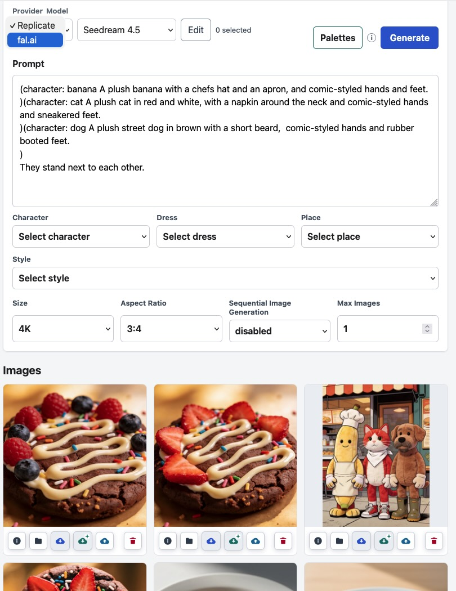

# imagegen

`imagegen` is a Flask web application for preparing image generation and image edit requests, sending them to Replicate, and keeping the generated images available in a local gallery.

Developer and agent contribution guidance lives in [AGENTS.md](AGENTS.md).



## Requirements

You machine needs to have `uv` (https://docs.astral.sh/uv/) and `git` installed.

The easiest way to get that on MacOS is homebrew.
On Windows, use a package manager like Chocolatey, Scoop or Winget.
On Linux you have those tools available as part of your Linux distribution.

You will also need an account on an image model provider.

- `https://replicate.com` (recommended) and/or 
- https://fal.ai (not recommended).

You will need to generate an API key on either or both image model providers.

## Installation

Clone the repository and enter the project directory.

Cloning the repository will download the Python code from github and install it in a directory on your machine.


```bash
git clone https://github.com/zoec98/imagegen-replicate
cd imgagen-replicate
```

Install the project environment with `uv sync`.

Syncing the project environment will install the required Python packages and dependencies,
and by providing the `--managed-python` switch will also install the required version of Python.

```bash
uv sync --managed-python
```


On MacOS and Linux, start `scripts/run-dev-sh` and stop it again.
On Windows, start `scripts\run-dev.cmd` and stop it again.

This will create a .env file in the project directory. It will look like the `env.example` file we provide.

Edit this file, and set at least one provider API key:

```bash
# API Token for calls to "replicate.com"
REPLICATE_API_TOKEN=...

# API Token for calls to "fal.ai"
FAL_KEY=
```

Also set the `AUTHOR` key:

```bash
# AUTHOR metadata information for EXIF
AUTHOR="It's me, Mario"
```

This will become part of the Author and Copyright EXIF metadata elements in each generated image.

You may want to change the data directory so that it does not overlap with the example data we provide.

```bash
# Directory where runtime data, images, palettes, trash, and SQLite live.
IMAGEGEN_DATA_DIR=data
```

Make a new directory `outputs` and set `IMAGEGEN_DATA_DIR=outputs`.
You can change this at any time, and for example, switch between a `clean` and `smut` setup.

The server needs to be stopped and restarted after any change to `.env`.

## Running

After making these changes you can start the server again, and connect to 127.0.0.1:5002.

```bash
scripts/run-dev.sh  # or scripts\run-dev.cmd on Windows
```

Then open:

```text
http://127.0.0.1:5002
```

The page loads and then talks to the server without reloading.
It will notice if the application has updated and will ask you to reload if it is outdated.

## Usage

1. Choose a model provider from the set of enabled providers.
2. Choose a model from the model selector.
3. Enter a prompt.
4. Set model-specific parameters such as image size, aspect ratio, guidance, seed, output format, or custom dimensions.
5. For image edits, enable `Edit`, select one or more existing gallery images as sources, then submit the request.
6. Press `Generate`.
7. Watch request status in the message area.
8. Use the gallery to open generated images, download metadata-rich or clean copies, inspect metadata, load metadata back into the workspace, or delete local images.

Image edit sources are selected from local gallery images.

Images are stored in the configured 
```text


```

## Prompt Palettes

Prompt palettes are reusable text fragments stored as plain text files.
Think of them as re-usable character descriptions, places or rendering styles.

By default, runtime palette files live under `data/fragments`.
The repository includes sample fragments under `data-example/fragments`;
use them as reference data or duplicate selected samples into your configured runtime fragment directory.

Each directory under the fragment root is one singular palette, such as `character` or `style`.
Each `.txt` file is one fragment.
Filenames store spaces as underscores, and the UI displays underscores as spaces.

Example:

```text
data-example/fragments/
|-- character
|   |-- aoife.txt
|   `-- zoe.txt
`-- style
    |-- comic_lawrence.txt
    `-- photo.txt
```

This creates `character` fragments named `aoife` and `zoe`, plus `style` fragments named `comic lawrence` and `photo`.

Fragment names and palette names must start with a letter and may contain only letters, numbers, underscores,
and hyphens.
Fragment content is limited to 1024 bytes and may not contain `(`, `)`, or `:`.

Selecting a palette entry inserts editable annotation text into the prompt:

```text
(character: zoe fragment content)
```

The browser keeps annotations visible so you can swap fragments later.
When a generation request is sent,
the server validates the prompt and strips annotation syntax before calling the model provider.
The provider receives only the fragment content and plain prompt text.
The app keeps the annotated prompt in request status, SQLite history, and embedded image metadata.

External edits to files under your configured fragment root, `data/fragments` by default, are picked up on page refresh.
The in-app palette editor can create, update, and delete entries inside existing palette directories,
but creating or deleting whole palette directories is a filesystem task.

## Gallery

Generated images appear in the local gallery. Each gallery card provides:

- The image itself as an open/view link to the stored local file. This version of the image contains EXIF metadata.
- An information button with filename, model, dimensions, and prompt.
- A load button that reads embedded metadata and replaces the current prompt, model, and supported settings.
- A normal download button that downloads the stored metadata-rich image.
- A clean download button that downloads a temporary copy with embedded metadata stripped.
- If configured, an upload button that sends the image to your configured immich server.
- A delete button that moves the local image to trash.

Images with metadata contain the author, copyright, full prompt parameters as embedded JSON, and a user-readable version of the prompt.
Clean download creates a separate stripped export for sharing outside the app;
it does not rewrite the stored gallery image.

Loading metadata requires metadata embedded by this app.
If metadata is missing or references an unsupported model/settings shape,
the UI shows an error and preserves the current workspace.

## Storage

Generated files are downloaded from the model provider into `data/images` by default.
Supported local image formats are PNG, JPEG, and WebP.

Set `IMAGEGEN_DATA_DIR` to move the runtime data root.
The app derives generated images, palette fragments, gallery trash, and SQLite history from that one directory.

Gallery delete moves files from `IMAGEGEN_DATA_DIR/images` to `IMAGEGEN_DATA_DIR/trash` by default.
If a trashed filename already exists, the app creates a unique trash filename instead of overwriting it.

The committed `data-example/` tree is sample/reference data.
The `data/` tree is the default local runtime directory for real generations, uploads, palette edits, trash,
and SQLite history.

Set `AUTHOR` in `.env` to the author name used for generated image metadata.
New `.env` files use `Noname Changeme Nescio` as a placeholder.
Copyright metadata is derived from the generated image year and `AUTHOR`.

Clean downloads are created on demand under `IMAGEGEN_DATA_DIR/tmp` by default, and deleted after download.

Image metadata writing and clean export handling are implemented in Python.
The app does not require `exiftool` or other shell metadata tools.

Palette fragments are stored under `IMAGEGEN_DATA_DIR/fragments` by default.
They are plain text files.

Durable request history is recorded in SQLite at `IMAGEGEN_DATA_DIR/imagegen.sqlite3` by default.
The database stores accepted request facts, prediction lifecycle state, and generated asset rows.
The active browser polling state remains in memory.

## Development

Use `uv` for all project commands:

```bash
uv sync
uv run pytest
uv run ruff format src tests
uv run ruff check --fix src tests
```

Developer scripts live in [scripts/](scripts):

- `scripts/run-dev.sh`
- `scripts/run-dev.cmd`
- `scripts/get_schema_replicate bytedance/seedream-4.5`
- `scripts/get_schema_falai https://fal.ai/models/fal-ai/bytedance/seedream/v4.5/text-to-image/api`

See [AGENTS.md](AGENTS.md) for project structure, testing expectations, Replicate integration rules, UI guidance,
and guardrails.
