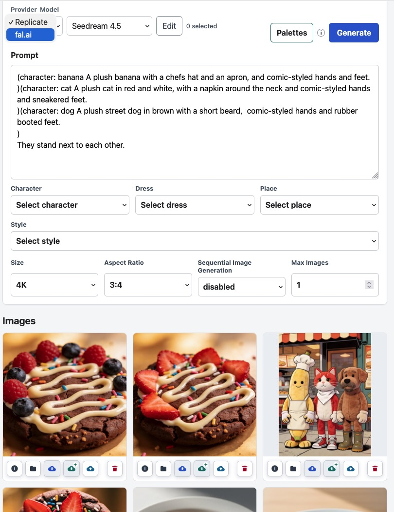

# imagegen

(Successor to https://github.com/zoec98/imagegen; feature parity or better than the previous version)

`imagegen` is a Flask web application for preparing image generation and image edit requests, sending them to configured image providers, and keeping the generated images available in a local gallery.

Developer and agent contribution guidance lives in [AGENTS.md](AGENTS.md).



## Support Chat

There is a support chat for imagegen on deviantArt. 
Contact @zoec98 on deviantArt to be added to that chat.

## Currently supported Providers and models

Model aliases are scoped to their provider. Models marked `edit` accept
existing gallery images as sources; `text` models are text-to-image only. A
provider appears in the UI only when its credentials are configured.

| Provider | Registered models |
| --- | --- |
| Replicate | `flux-flex` — Flux 2 Flex (edit)<br>`gpt-image-15` — GPT Image 1.5 (edit)<br>`gpt-image-2` — GPT Image 2 (edit)<br>`gpt-image-25-flare` — GPT Image 2.5 Flare (edit)<br>`gpt-image-25-sunburst` — GPT Image 2.5 Sunburst (edit)<br>`grok-imagine` — Grok Imagine (edit)<br>`imagen-4` — Imagen 4 (text)<br>`imagen-4-fast` — Imagen 4 Fast (text)<br>`imagen-4-ultra` — Imagen 4 Ultra (text)<br>`nano-banana-2` — Nano Banana 2 (edit)<br>`nano-banana-pro` — Nano Banana Pro (edit)<br>`qwen-2512` — Qwen Image 2512 (edit)<br>`seedream45` — Seedream 4.5 (edit)<br>`seedream5` — Seedream 5 Lite (edit)<br>`seedream5-pro` — Seedream 5 Pro (edit)<br>`wan-27-pro` — Wan 2.7 Image Pro (edit) |
| fal.ai | `bria-fibo` — Bria Fibo (edit)<br>`ernie-image` — Ernie Image (text)<br>`ernie-image-turbo` — Ernie Image Turbo (text)<br>`flux-2` — Flux 2 (edit)<br>`flux-2-pro` — Flux 2 Pro (edit)<br>`flux-2-realism` — Flux 2 Realism (text)<br>`gpt-image-2` — GPT Image 2 (edit)<br>`gpt-image-25-flare` — GPT Image 2.5 Flare (edit)<br>`gpt-image-25-sunburst` — GPT Image 2.5 Sunburst (edit)<br>`gpt-image15` — GPT Image 1.5 (edit)<br>`grok` — Grok Imagine Image (edit)<br>`hidream-dev` — HiDream I1 Dev (text)<br>`hidream-fast` — HiDream I1 Fast (text)<br>`hidream-full` — HiDream I1 Full (text)<br>`krea-2-large` — Krea 2 Large (text)<br>`krea-2-medium` — Krea 2 Medium (text)<br>`krea-2-turbo` — Krea 2 Turbo (edit)<br>`nano-banana-2` — Nano Banana 2 (edit)<br>`seedream` — Seedream 4 (edit)<br>`seedream45` — Seedream 4.5 (edit)<br>`seedream5` — Seedream 5 Lite (edit)<br>`seedream5-pro` — Seedream 5 Pro (edit)<br>`zit` — Z-Image Turbo (edit) |
| Wiro | `flux-2-flex` — Flux 2 Flex (edit)<br>`gpt-image-15` — GPT Image 1.5 (edit)<br>`gpt-image-2` — GPT Image 2 (edit)<br>`grok-imagine` — Grok Imagine Image (edit)<br>`hidream-dev` — HiDream I1 Dev (text)<br>`hidream-fast` — HiDream I1 Fast (text)<br>`nano-banana-2` — Nano Banana 2 (edit)<br>`nano-banana-pro` — Nano Banana Pro (edit)<br>`seedream45-uncensored` — Seedream 4.5 Uncensored (edit)<br>`seedream5-lite-uncensored` — Seedream 5 Lite Uncensored (edit)<br>`seedream5-pro-uncensored` — Seedream 5 Pro Uncensored (edit)<br>`z-image-turbo` — Z-Image Turbo (text) |

More providers, missing models or features can be added.
Join the Support Chat on deviantArt, and request what you need.

## Requirements

Your machine needs to have `uv` (https://docs.astral.sh/uv/) and `git` installed.

The easiest way to get that on MacOS is homebrew.
On Windows, use a package manager like Chocolatey, Scoop or Winget.
On Linux you have those tools available as part of your Linux distribution.

You will also need an account on an image model provider.

- `https://replicate.com` (recommended),
- `https://fal.ai` (not recommended), and/or
- `https://wiro.ai` (API-key-only projects).

You will need to generate an API key on at least one image model provider.

## Installation

Clone the repository and enter the project directory.

Cloning the repository will download the Python code from github and install it in a directory on your machine.


```bash
git clone https://github.com/zoec98/imagegen-replicate
cd imgagen-replicate
```

Install the project environment with `uv sync`.

Syncing the project environment will install the required Python packages and dependencies,
and by providing the `--managed-python` switch will also install the required version of Python.

```bash
uv sync --managed-python
```


On MacOS and Linux, start `scripts/run-dev.sh` and stop it again.
On Windows, start `scripts\run-dev.cmd` and stop it again.

This will create a .env file in the project directory. It will look like the `env.example` file we provide, except that `IMAGEGEN_FLASK_SECRET_KEY` is filled with a generated random session secret.

Edit this file, and set at least one provider API key:

```bash
# API Token for calls to "replicate.com"
REPLICATE_API_TOKEN=...

# API Token for calls to "fal.ai"
FAL_KEY=

# API key for calls to Wiro. Use an API-key-only Wiro project.
WIRO_API_KEY=
```

Wiro uses only `WIRO_API_KEY`; the account's API secret is not required by
this application. The complete provider/model list is below.

Also set the `AUTHOR` key:

```bash
# AUTHOR metadata information for EXIF
AUTHOR="It's me, Mario"
```

This will become part of the Author and Copyright EXIF metadata elements in each generated image.

You may want to change the data directory so that it does not overlap with the example data we provide.

```bash
# Directory where runtime data, images, palettes, trash, and SQLite live.
IMAGEGEN_DATA_DIR=data

# Days to keep trash before automatic purge. Use 0 to disable.
TRASHCAN_HOLD_LIMIT_DAYS=7
```

Make a new directory `outputs` and set `IMAGEGEN_DATA_DIR=outputs`.
You can change this at any time, and for example, switch between a `clean` and `smut` setup.

The server needs to be stopped and restarted after any change to `.env`.

If you want the upload overlay to browse and import from the Immich main
gallery, configure the Immich server URL and an API key:

```bash
# Immich server base URL.
IMMICH_URL=https://immich.example.com

# Immich API key.
IMMICH_API_KEY=...
```

The Immich API key needs `asset.read` to list main-gallery images, `asset.view`
to display thumbnails, and `asset.download` to import a selected original image.

If you also want the local gallery's per-image Immich upload action, configure
an upload album id:

```bash
# Immich album id used only when uploading local gallery images to Immich.
IMMICH_UPLOAD_ALBUM_ID=...
```

That album id is not used for browsing the Immich main gallery. Existing `.env`
files that still use `IMMICH_GALLERY_ID` are treated as the upload album id for
backward compatibility.

Immich browsing is optional. Without `IMMICH_URL` and `IMMICH_API_KEY`, URL
imports and local file uploads still work, but the Immich browser is hidden.

See below the section on [Prompt Palettes](#prompt-palettes) for information on what they are and how to set them up.
You may want to make additional directories in your data directories fragments directory.
The coding agent specification on prompt palettes is in this file: [Prompt Palettes](developer/prompt-palettes.md).

## Running

After making these changes you can start the server again, and connect to 127.0.0.1:5002.

```bash
scripts/run-dev.sh  # or scripts\run-dev.cmd on Windows
```

Debug mode is off by default. For local development with the Flask debugger and
reloader, pass `--dev`:

```bash
scripts/run-dev.sh --dev  # or scripts\run-dev.cmd --dev on Windows
```

To use the app from another trusted device on a secure household LAN, bind to all
network interfaces explicitly:

```bash
scripts/run-dev.sh --secure-network  # or scripts\run-dev.cmd --secure-network on Windows
```

If an older `.env` still contains `IMAGEGEN_FLASK_SECRET_KEY=dev-secret-change-me`,
the start script warns before `--secure-network` startup. The app setup replaces
that value with a random secret before startup.

The flags can be combined when you explicitly want both behaviors:

```bash
scripts/run-dev.sh --secure-network --dev
```

Then open:

```text
http://127.0.0.1:5002
```

The page loads and then talks to the server without reloading.
It will notice if the application has updated and will ask you to reload if it is outdated.

## Usage

1. Choose a model provider from the set of enabled providers.
2. Choose a model from the model selector.
3. Enter a prompt.
4. Set model-specific parameters such as image size, aspect ratio, guidance, seed, output format, or custom dimensions.
5. Use `Upload` when you want to import an existing image from a URL, one dropped local image file, or a configured Immich gallery.
6. For image edits, enable `Edit`, select one or more existing gallery images as sources, then submit the request.
7. Press `Generate`.
8. Watch request status in the message area.
9. Use the gallery to open generated or imported images, download metadata-rich or clean copies, inspect metadata, load metadata back into the workspace, create edit masks, or delete local images.

Image edit sources are selected from local gallery images.
Generated images are stored under `IMAGEGEN_DATA_DIR/images`, `data/images` by default.

## Command-line use

Run `imagegen` from the project root. It reads the same `.env` and writes
results to the same gallery as the web application.

Use help to discover providers and models, then model-specific help to discover
the model's parameters:

```bash
uv run imagegen --help
uv run imagegen --provider replicate --model seedream45 --help
```

Select a model by its alias or by its display name:

```bash
uv run imagegen --provider replicate --model seedream45 --prompt "a red fox"
uv run imagegen --provider falai --model "Seedream 4.5" --file prompts/fox.txt
uv run imagegen --provider wiro --model seedream5-lite-uncensored --prompt "a red fox"
```

`--prompt` and `--file` are mutually exclusive. Prompt files are read as UTF-8
and surrounding whitespace is removed. Model parameters use their registry
names; both underscore and hyphen spellings are accepted, such as
`--image_size` and `--image-size`. Boolean parameters use paired options such
as `--sync_mode` and `--no-sync_mode`.

Without `--quiet`, successful generation prints the completed request JSON.

With `--quiet`, it prints only reusable project-root-relative image paths, one
per line, for example `outputs/images/seedream45-prediction-123-01.jpg`.
Errors go to stderr. Exit status `0` means success, `1` means generation or
runtime failure, and `2` means argument or validation failure. The same help
text is intended for both human users and language-model agents.

## Image Uploads

Use the `Upload` button next to the trash control to add existing images to the
local gallery.

The upload overlay supports:

- URL import: paste an `http` or `https` image URL and press `Load`.
- Local file upload: drop one local image file into the drop target.
- Immich import: when Immich main-gallery import is configured, browse the
  Immich main gallery in pages of 20 images and import one selected image.

Imported files are stored in the configured images directory with generated
local filenames such as `import-...png`. The app does not preserve remote,
uploaded, or Immich filenames as local paths.

The first drag-and-drop implementation accepts one file at a time. Multi-file
drops are rejected in the browser, and the server still validates every upload.

The Immich browser is paginated and loads one batch of 20 images at a time. It
does not include search, filtering, or bulk import yet.

## Prompt Palettes

Prompt palettes are reusable text fragments stored as plain text files.
Think of them as re-usable character descriptions, places or rendering styles.

By default, runtime palette files live under `data/fragments`.
The repository includes sample fragments under `data-example/fragments`;
use them as reference data or duplicate selected samples into your configured runtime fragment directory.

Each directory under the fragment root is one singular palette, such as `character` or `style`.
Each `.txt` file is one fragment.
Filenames store spaces as underscores, and the UI displays underscores as spaces.

Example:

```text
data-example/fragments/
|-- character
|   |-- aoife.txt
|   `-- zoe.txt
`-- style
    |-- comic_lawrence.txt
    `-- photo.txt
```

This creates `character` fragments named `aoife` and `zoe`, plus `style` fragments named `comic lawrence` and `photo`.

Fragment names and palette names must start with a letter and may contain only letters, numbers, underscores,
and hyphens.
Fragment content is limited to 1024 bytes and may not contain `(`, `)`, or `:`.

Selecting a palette entry inserts editable annotation text into the prompt:

```text
(character: zoe fragment content)
```

The browser keeps annotations visible so you can swap fragments later.
When a generation request is sent,
the server validates the prompt and strips annotation syntax before calling the model provider.
The provider receives only the fragment content and plain prompt text.
The app keeps the annotated prompt in request status, SQLite history, and embedded image metadata.

External edits to files under your configured fragment root, `data/fragments` by default, are picked up on page refresh.
The in-app palette editor can create, update, and delete entries inside existing palette directories,
but creating or deleting whole palette directories is a filesystem task.

## Gallery

Generated and imported images appear in the local gallery. Each gallery card provides:

- The image itself as an open/view link to the stored local file. This version of the image contains EXIF metadata.
- An information button with filename, model, dimensions, and prompt.
- A load button that reads embedded metadata and replaces the current prompt, model, and supported settings.
- A normal download button that downloads the stored metadata-rich image.
- A clean download button that downloads a temporary copy with embedded metadata stripped.
- A mask button that opens a simple mask editor for the image.
- If configured, an upload button that sends the image to your configured immich server.
- A delete button that moves the local image to trash.

Images with metadata contain the author, copyright, full prompt parameters as embedded JSON, and a user-readable version of the prompt.
Clean download creates a separate stripped export for sharing outside the app;
it does not rewrite the stored gallery image.

Loading metadata requires metadata embedded by this app.
If metadata is missing or references an unsupported model/settings shape,
the UI shows an error and preserves the current workspace.

### Edit masks

Some image edit models accept a layer mask that limits where the edit is applied.
Use the mask button on a gallery image to open the mask editor.

In the editor:

1. Paint over the image; the painted area is shown as a red overlay.
2. Adjust brush size to change the stroke diameter.
3. Adjust falloff to change how quickly the brush fades from the center to the edge.
4. Use `Invert mask` when the unpainted area should become the selected area.
5. Use `Save mask` to write the mask and return to the gallery.

Saved masks appear in the gallery without a page reload.
The mask file is saved next to the source image with the same stem plus `-mask.png`;
for example, `portrait.png` saves as `portrait-mask.png`.

Mask files are 8-bit black-and-white PNGs with the same pixel dimensions as the source image.
Unpainted pixels are black, fully painted pixels are white, and soft brush falloff is stored as grayscale values between black and white.

## Storage

Generated files are downloaded from the model provider into `data/images` by default.
Imported URL, dropped local, and Immich images are stored in the same gallery
directory.
Supported local image formats are PNG, JPEG, and WebP.

Set `IMAGEGEN_DATA_DIR` to move the runtime data root.
The app derives generated images, palette fragments, gallery trash, and SQLite history from that one directory.

Gallery delete moves files from `IMAGEGEN_DATA_DIR/images` to `IMAGEGEN_DATA_DIR/trash` by default.
If a trashed filename already exists, the app creates a unique trash filename instead of overwriting it.

Use the trashcan button next to the palette controls to open the trash overlay.
The button label shows the current number of images in trash.
Inside the overlay, use `Restore` to move an image back to the main gallery, or `Empty trash` to permanently delete all eligible trashed images.

Trash is automatically purged when the gallery refreshes.
By default, files older than 7 days are deleted from `IMAGEGEN_DATA_DIR/trash`.
Set `TRASHCAN_HOLD_LIMIT_DAYS` in `.env` to change the retention period.
Set it to `0`, or to an invalid value, to disable automatic purging.

The committed `data-example/` tree is sample/reference data.
The `data/` tree is the default local runtime directory for real generations, uploads, palette edits, trash,
and SQLite history.

Set `AUTHOR` in `.env` to the author name used for generated image metadata.
New `.env` files use `Noname Changeme Nescio` as a placeholder.
Copyright metadata is derived from the generated image year and `AUTHOR`.

Clean downloads are created on demand under `IMAGEGEN_DATA_DIR/tmp` by default, and deleted after download.

Image metadata writing and clean export handling are implemented in Python.
The app does not require `exiftool` or other shell metadata tools.

Palette fragments are stored under `IMAGEGEN_DATA_DIR/fragments` by default.
They are plain text files.

Durable request history is recorded in SQLite at `IMAGEGEN_DATA_DIR/imagegen.sqlite3` by default.
The database stores accepted request facts, prediction lifecycle state, and generated asset rows.
The active browser polling state remains in memory.

## Development

Use `uv` for all project commands:

```bash
uv sync
uv run pytest
uv run ruff format src tests
uv run ruff check --fix src tests
```

Developer scripts live in [scripts/](scripts):

- `scripts/run-dev.sh`
- `scripts/run-dev.cmd`
- `scripts/get_schema_replicate bytedance/seedream-4.5`
- `scripts/get_schema_falai https://fal.ai/models/fal-ai/bytedance/seedream/v4.5/text-to-image/api`
- `scripts/get_schema_wiro bytedance/seedream-v5-pro-uncensored`

See [AGENTS.md](AGENTS.md) for project structure, testing expectations, Replicate integration rules, UI guidance,
and guardrails.
